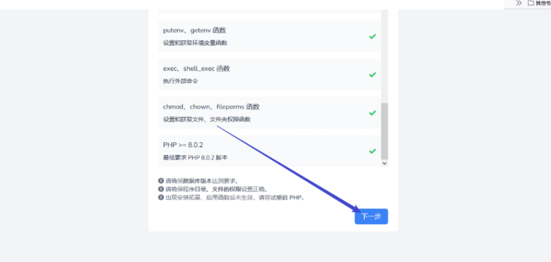
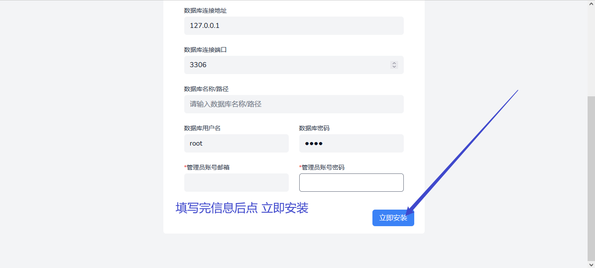
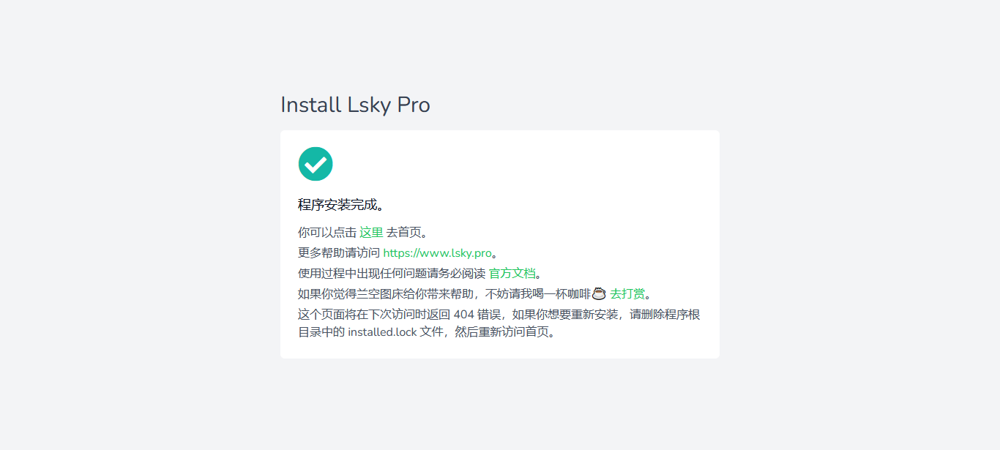
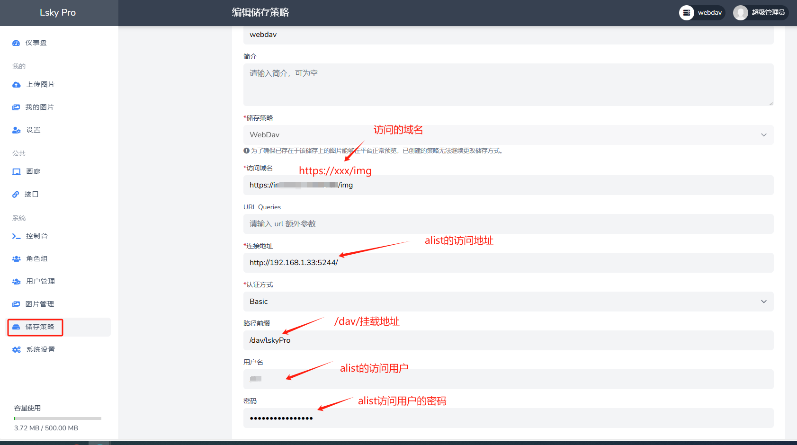
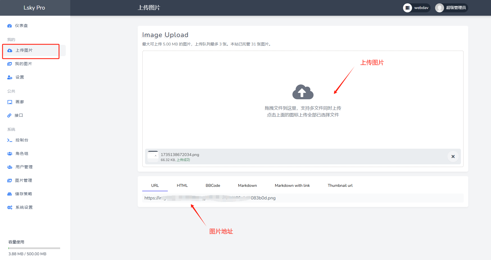
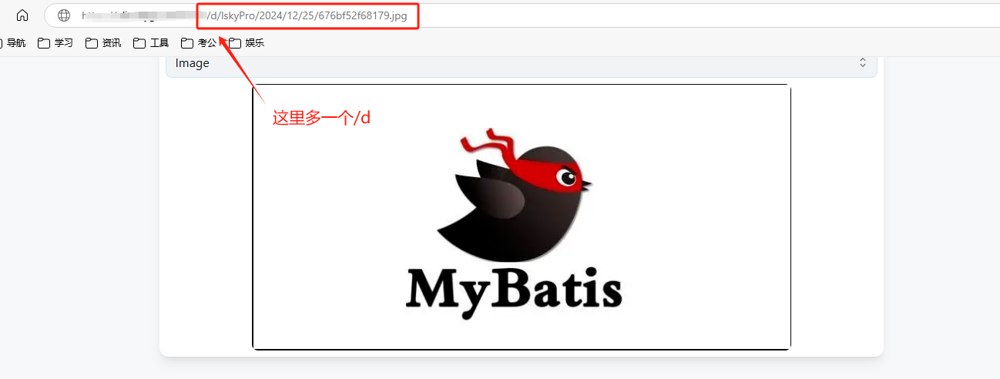
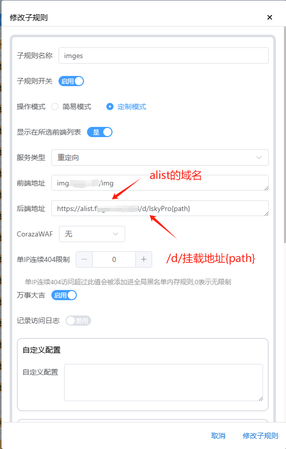

# LskyPro 图床安装与配置指南 
<!--more-->
## 1. Docker 安装

使用 Docker 一键部署 LskyPro：

```bash
docker run -d \
  --name lsky-pro \
  --restart unless-stopped \
  -p 40027:8089 \
  -v /mnt/sda3/Configs/lsky-pro/data:/var/www/html \
  -e WEB_PORT=8089 \
  halcyonazure/lsky-pro-docker:latest
```

## 2. 初始化配置

1. 访问管理页面：`http://127.0.0.1:40027`
2. 按照界面提示完成初始化设置（部分图片引用[该文章](https://zhuanlan.zhihu.com/p/667419644)）：





## 3. 配置 Alist WebDAV 存储

### 3.1 创建存储策略
1. 进入「储存策略」页面
2. 点击「创建储存策略」
3. 配置 WebDAV 参数：



### 3.2 测试上传
上传测试图片验证配置：



## 4. 问题及解决

### 4.1 图片 404 问题
**问题描述**：图片可以上传，但访问时出现 404 错误。
**原因**：Alist 的真实路径中包含 `/d` 路径。



### 4.2 解决方案
使用 Nginx/Lucky 进行路径重定向：



### 4.3 报错401
需要在alist中去掉签名


## 参考资料
- [LskyPro 文档](https://docs.lsky.pro/)
- [图片 404 问题解决方案](https://github.com/lsky-org/lsky-pro/issues/520)