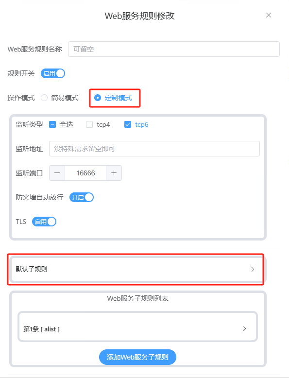

# Lucky 容器在 iKuai 路由器中的配置指南

> 本文介绍如何在 iKuai 路由器中使用 Lucky 容器实现反向代理和 HTTPS 证书认证功能。
<!--more-->

## 一、安装 Lucky Docker 容器

1. 在 iKuai 管理界面中安装 Docker 容器：
   
   

2. 搜索并下载镜像：
   - 搜索 `gdy666/lucky` 镜像
   - 选择并下载 `gdy666/lucky:latest` 版本
   
   

3. 配置网络接口：
   - 添加新的网络接口
   - 配置网段（示例：192.168.3.0/24，路由器 IP 为 192.168.1.1）
   
   

4. 创建并配置容器：
   
   

## 二、DDNS 配置

1. 选择并配置 AliDNS：
   - 填入阿里云 AccessKey 和 SecretKey
   - 配置域名（例如：*.baidu.com）
   
   

2. 确认配置成功：
   - 同步状态显示为绿色
   - 可以正确获取公网 IP
   

## 三、HTTPS 证书配置

1. 配置 ACME 证书：
   - 选择 ACME 服务
   - DNS 服务商选择阿里云
   - 填入 AccessKey 和 SecretKey
   - 添加域名列表（每行一个域名）
   
   

## 四、配置反向代理

1. 创建代理规则：
   - 设置服务规则名称
   - 配置监听端口（如 8088）
   - 启用 TLS
   
   

2. 配置子服务规则：
   - 设置域名映射（如：alist.baidu.com → 192.168.1.35:5244）
   

3. 配置 HTTP 重定向：
   - 添加默认规则
   - 设置 HTTP 到 HTTPS 的重定向
   
   
   

## 总结

完成以上配置后，您将获得：
- 自动更新的 DDNS 服务
- 自动续期的 HTTPS 证书（过期前 31 天自动更新）
- 功能完善的反向代理服务

更多详细信息，请参考 [Lucky 官方文档](https://lucky666.cn/docs/intro)