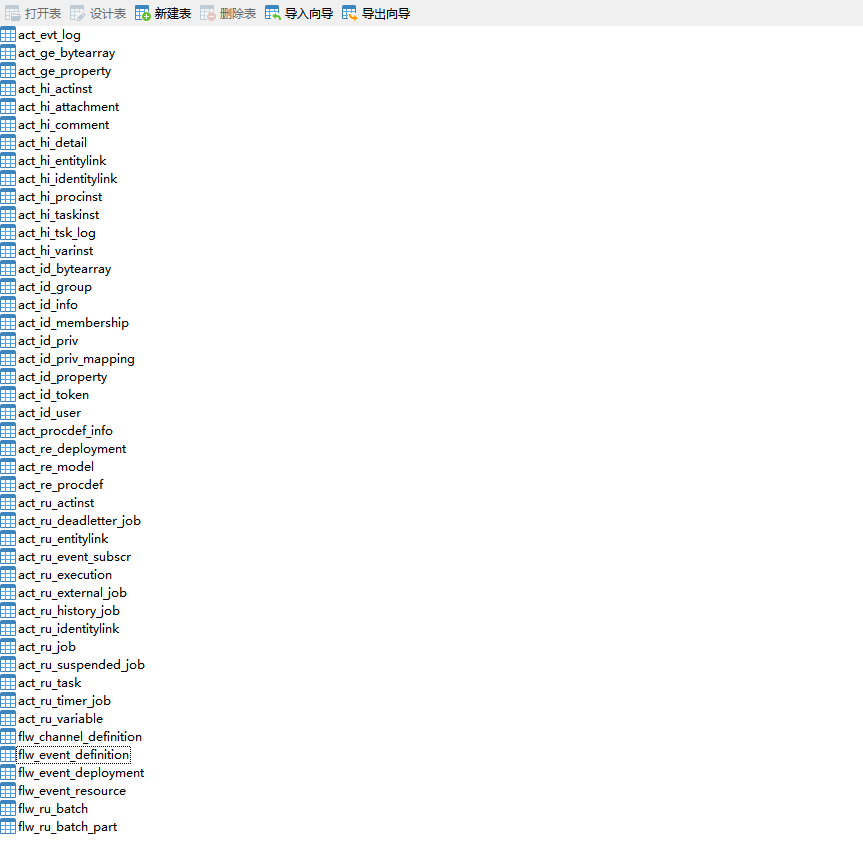
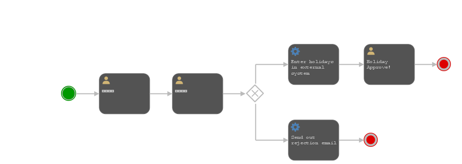

## flowable工作流引擎学习 （一）
### 一、工作流引擎Flowable
Flowable是一个使用Java编写的轻量级业务流程引擎。Flowable流程引擎可用于部署BPMN 2.0流程定义（用于定义流程的行业XML标准）， 创建这些流程定义的流程实例，进行查询，访问运行中或历史的流程实例与相关数据等。

### 二、开始简单流程实战
#### 1、简单流程
我们将构建一个简单的请假流程：
- 雇员（employee）请假
- 经理（manager）批准或驳回申请

##### 1.1、创建流程
###### 1.1.1、创建maven项目
创建leaveApproval的maven项目，添加maven依赖
```xml
<!--Flowable流程引擎-->
    <dependency>
      <groupId>org.flowable</groupId>
      <artifactId>flowable-engine</artifactId>
      <version>7.2.0</version>
    </dependency>
    <!--MySQL驱动，这里采用MySQL数据库，如果采用其它数据库，需要引入对应的依赖。-->
    <dependency>
      <groupId>com.mysql</groupId>
      <artifactId>mysql-connector-j</artifactId>
      <version>9.0.0</version>
    </dependency>
    <!-- lowable使用SLF4J作为内部日志框架，使用log4j作为SLF4J的实现 -->
    <dependency>
      <groupId>org.slf4j</groupId>
      <artifactId>slf4j-api</artifactId>
      <version>2.0.7</version>
    </dependency>
    <dependency>
      <groupId>org.slf4j</groupId>
      <artifactId>slf4j-log4j12</artifactId>
      <version>2.0.7</version>
    </dependency>
```
在resources下创建log4j.properties
```properties
log4j.rootLogger=DEBUG, CA

log4j.appender.CA=org.apache.log4j.ConsoleAppender
log4j.appender.CA.layout=org.apache.log4j.PatternLayout
log4j.appender.CA.layout.ConversionPattern= %d{hh:mm:ss,SSS} [%t] %-5p %c %x - %m%n
```

###### 1.1.2、创建数据库表格
- 创建一个数据库flowable_demo
- 创建一个普通的Java类：LeaveProvalRequest
```java
public class LeaveProvalRequest {
    public static void main(String[] args) {
        //创建ProcessEngineConfiguration实例
        ProcessEngineConfiguration cfg = new StandaloneProcessEngineConfiguration()
                //配置数据库
                .setJdbcUrl("jdbc:mysql://127.0.0.1:3306/flowable_demo?characterEncoding=UTF-8&autoReconnect=true&zeroDateTimeBehavior=convertToNull&useUnicode=true&serverTimezone=GMT%2b8")
                .setJdbcUsername("root")
                .setJdbcPassword("Fh7bdhm3322MHe7a")
                .setJdbcDriver("com.mysql.cj.jdbc.Driver")
                .setDatabaseSchemaUpdate(ProcessEngineConfiguration.DB_SCHEMA_UPDATE_CREATE);
        //初始化ProcessEngine流程引擎实例
        ProcessEngine processEngine = cfg.buildProcessEngine();
    }
}

```
###### 1.1.3 执行java创建数据库表
- 遇到的报错

```
version mismatch: library version is '7.2.0.2', db version is 6.1.2.0 Hint: Set <property name="databaseSchemaUpdate" to value="true" or value="create-drop" (use create-drop for testing only!) in bean processEngineConfiguration in flowable.cfg.xml for automatic schema creation
```
[参考链接](https://blog.csdn.net/gu_zhang_w/article/details/107102292)
需要在jdbcUrl中加入nullCatalogMeansCurrent
```yml
## nullCatalogMeansCurrent：是否将null catalog看作当前catalog（解决 MySql 8.0 以上版本不生成指定数据库代码的问题）
jdbc:mysql://127.0.0.1:3306/flowable_demo?characterEncoding=UTF-8&autoReconnect=true&zeroDateTimeBehavior=convertToNull&useUnicode=true&serverTimezone=GMT%2b8&nullCatalogMeansCurrent=true
```
运行java类，生成45张表


###### 1.1.4、创建的表格说明
flowable命名规则：
- ACT_RE_* ：'RE'表示repository（存储）。RepositoryService接口操作的表。带此前缀的表包含的是静态信息，如，流程定义，流程的资源（图片，规则等）。
- ACT_RU_* ：'RU'表示runtime。这是运行时的表存储着流程变量，用户任务，变量，职责（job）等运行时的数据。flowable只存储实例执行期间的运行时数据，当流程实例结束时，将删除这些记录。这就保证了这些运行时的表小且快。
- ACT_ID_* : 'ID'表示identity(组织机构)。这些表包含标识的信息，如用户，用户组，等等。
- ACT_HI_* : 'HI'表示history。就是这些表包含着历史的相关数据，如结束的流程实例，变量，任务，等等。
- ACT_GE_* : 普通数据，各种情况都使用的数据。

#### 1.2 部署流程
Flowable引擎需要流程定义为BPMN 2.0格式,
```xml
<?xml version="1.0" encoding="UTF-8"?>
<definitions xmlns="http://www.omg.org/spec/BPMN/20100524/MODEL" xmlns:xsi="http://www.w3.org/2001/XMLSchema-instance"
             xmlns:xsd="http://www.w3.org/2001/XMLSchema" xmlns:flowable="http://flowable.org/bpmn"
             xmlns:bpmndi="http://www.omg.org/spec/BPMN/20100524/DI"
             xmlns:omgdc="http://www.omg.org/spec/DD/20100524/DC" xmlns:omgdi="http://www.omg.org/spec/DD/20100524/DI"
             typeLanguage="http://www.w3.org/2001/XMLSchema" expressionLanguage="http://www.w3.org/1999/XPath"
             targetNamespace="http://www.flowable.org/processdef">
    <process id="leave_approval" name="请假审批" isExecutable="true">
        <!--开始事件：流程实例的起点-->
        <startEvent id="startEvent"/>
        <!--顺序流：执行时会从一个活动流向另一个活动-->
        <sequenceFlow sourceRef="startEvent" targetRef="leaveApprovalRequest"/>
        <!--用户任务：需要人工来进行操作-->
        <userTask id="leaveApprovalRequest" name="请假请求" flowable:assignee="${employee}"/>
        <sequenceFlow sourceRef="leaveApprovalRequest" targetRef="approval"/>

        <userTask id="approval" name="审批请假" flowable:candidateGroups="managers"/>
        <sequenceFlow sourceRef="approval" targetRef="decision"/>
        <!--排他网关-->
        <exclusiveGateway id="decision"/>
        <sequenceFlow sourceRef="decision" targetRef="externalSystemCall">
            <!--顺序流条件：以表达式(expression)的形式定义了条件(condition) -->
            <!--条件表达式：是${approved == true}的简写-->
            <conditionExpression xsi:type="tFormalExpression">
                <![CDATA[
                  ${approved}
                ]]>
            </conditionExpression>
        </sequenceFlow>
        <sequenceFlow sourceRef="decision" targetRef="sendRejectionMail">
            <conditionExpression xsi:type="tFormalExpression">
                <![CDATA[
                  ${!approved}
                ]]>
            </conditionExpression>
        </sequenceFlow>

        <!--服务任务，一个自动活动，它会调用一些服务-->
        <serviceTask id="externalSystemCall" name="Enter holidays in external system" flowable:class="com.xbl.example.CallExternalSystemDelegate"/>
        <sequenceFlow sourceRef="externalSystemCall" targetRef="holidayApprovedTask"/>
        <userTask id="holidayApprovedTask" name="Holiday Approve!"/>
        <sequenceFlow sourceRef="holidayApprovedTask" targetRef="approveEnd"/>

        <serviceTask id="sendRejectionMail" name="Send out rejection email" flowable:class="com.xbl.example.SendRejectionMail"/>
        <sequenceFlow sourceRef="sendRejectionMail" targetRef="rejectEnd"/>

        <!--结束事件-->
        <endEvent id="approveEnd"/>
        <endEvent id="rejectEnd"/>
    </process>
</definitions>
```
#### 1.3 加载执行流程
```java
        //加载流程
        Deployment deployment = repositoryService.createDeployment()
                .addClasspathResource("request.bpmn20.xml")
                .deploy();
        //查询流程定义
        ProcessDefinition processDefinition = repositoryService.createProcessDefinitionQuery()
                .deploymentId(deployment.getId())
                .singleResult();
        System.out.println("Found process definition : " + processDefinition.getName());
        //开启流程
        RuntimeService runtimeService = processEngine.getRuntimeService();
        Map<String, Object> variables = new HashMap<String, Object>();
        variables.put("employee", "张三");
        variables.put("days", "3天");
        variables.put("description", "请假3天");
        ProcessInstance processInstance = runtimeService.startProcessInstanceByKey("leave_approval", variables);
        //通过TaskService查询 请假者 的任务
        TaskService taskService = processEngine.getTaskService();
        Task task1 = taskService.createTaskQuery().taskAssignee("张三").singleResult();
        if (task1 != null) {

            System.out.println("==========================张三的任务" + task1.getId() + ":" + task1.getName());
            taskService.complete(task1.getId());
        }
        //经理审批的任务
        List<Task> tasks = taskService.createTaskQuery().taskCandidateGroup("managers").list();
        System.out.println("You have " + tasks.size() + " tasks:");
        for (int i = 0; i < tasks.size(); i++) {
            System.out.println((i + 1) + "==========================：" + tasks.get(i).getName());
            Map<String, Object> variables2 = new HashMap<String, Object>();
            variables2.put("approved", false);
            variables2.put("comment", "不同意");
            taskService.complete(tasks.get(i).getId(), variables2);
        }

        // 5. 检查流程是否结束
        ProcessInstance result = runtimeService.createProcessInstanceQuery()
                .processInstanceId(processInstance.getId())
                .singleResult();
        if (result == null) {
            System.out.println("流程已成功结束");
        } else {
            System.out.println("流程仍在运行中");
        }
```
获取流程图
```java
private static void generateProcessInstance(RepositoryService repositoryService, String processDefinitionId, ProcessEngine processEngine) {
        BpmnModel bpmnModel = repositoryService.getBpmnModel(processDefinitionId);
        // 检查模型有效性
        if (bpmnModel == null || bpmnModel.getProcesses().isEmpty()) {
            System.out.println("BPMN模型为空或无效");
            return;
        }

        ProcessEngineConfiguration engConf = processEngine.getProcessEngineConfiguration();
        ProcessDiagramGenerator diagramGenerator = engConf.getProcessDiagramGenerator();

        // 生成流程图输入流
        InputStream in = diagramGenerator.generateDiagram(
                bpmnModel,
                "png",
                Collections.emptyList(),
                Collections.emptyList(),
                engConf.getActivityFontName(),
                engConf.getLabelFontName(),
                engConf.getAnnotationFontName(),
                engConf.getClassLoader(),
                1.0,
                true);

        try {
            File outputFile = new File("leave_approval_process_diagram.png");
            FileUtils.copyInputStreamToFile(in, outputFile);
            // 显示完整路径
            System.out.println("流程图已生成：" + outputFile.getAbsolutePath());
        } catch (IOException e) {
            e.printStackTrace();
        } finally {
            if (in != null) {
                try {
                    in.close();
                } catch (IOException e) {
                    e.printStackTrace();
                }
            }
        }
    }
```
在获取流程图中出问题，报错
```
Cannot invoke "org.flowable.bpmn.model.GraphicInfo.getX()" because "flowNodeGraphicInfo" is null
```
由于在bpmn20.xml文件中没有添加BPMN图形信息，需要添加

