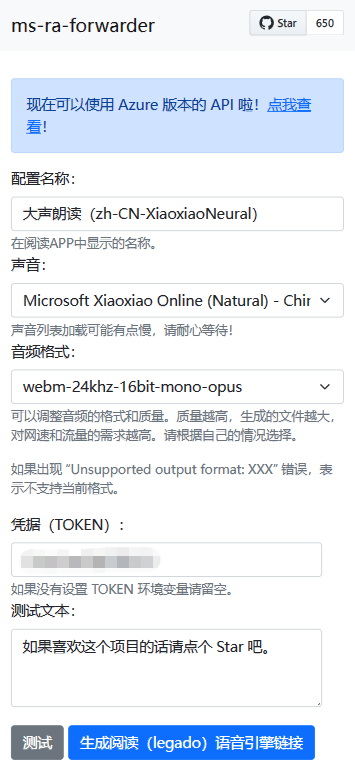
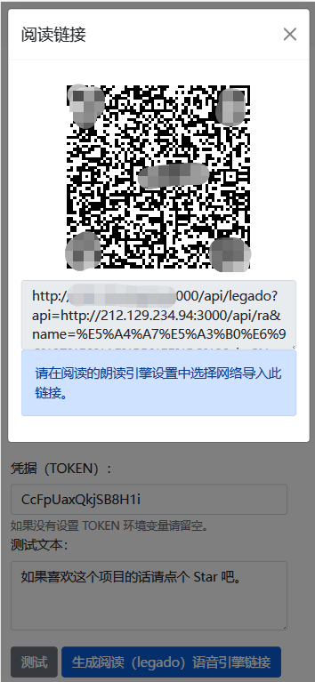
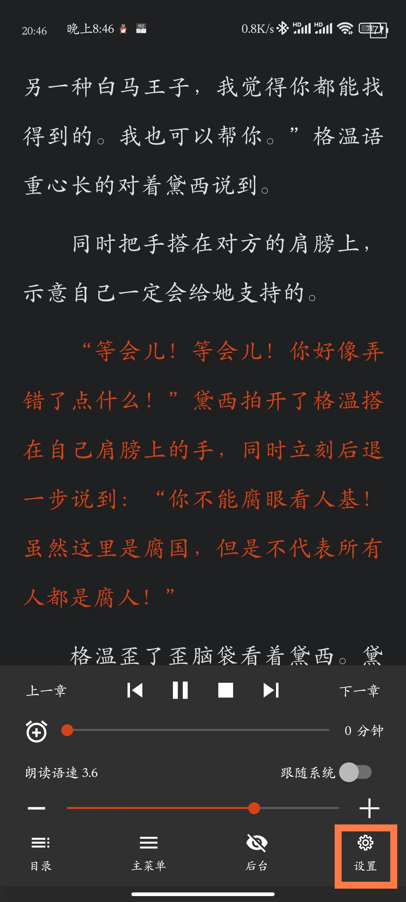
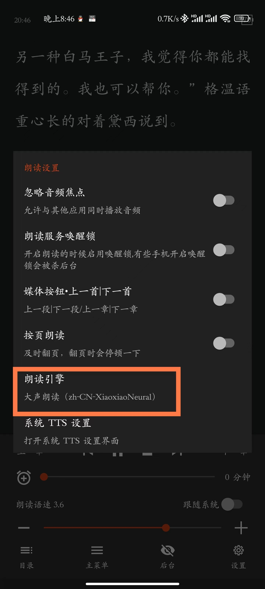
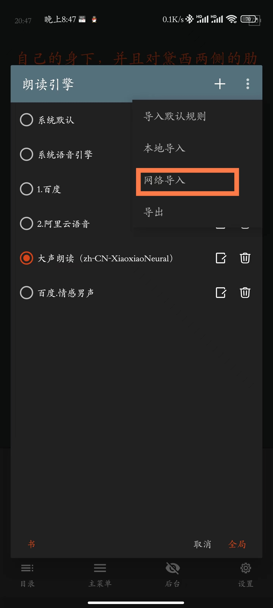

# 在阅读App中使用微软TTS服务搭建教程
## 背景介绍
 为了在「阅读」(legado) App中实现听书功能
 使用 ms-ra-forwarder 项目通过 Docker 快速部署微软 TTS 服务 
## Docker 环境搭建
```bash
# 1. 拉取最新镜像
docker pull wxxxcxx/ms-ra-forwarder:latest
# 2. 运行容器（二选一）
# 方式一：无 TOKEN 验证
docker run --name ms-ra-forwarder -d -p 3000:3000 wxxxcxx/ms-ra-forwarder
# 方式二：启用 TOKEN 验证（推荐）
docker run --name ms-ra-forwarder -d -p 3000:3000 -e TOKEN=自定义TOKEN wxxxcxx/ms-ra-forwarder
```
## 配置语音引擎
### 第一步：生成语音引擎链接
. 访问服务地址：`http://ip:3000/`
. 选择合适的声音和音频格式
. 如有设置 TOKEN，需填入对应值
. 点击生成语音引擎链接


### 第二步：在阅读App中导入
. 打开阅读App
. 依次进入：朗读 > 设置 > 朗读引擎 > ... > 网络导入
. 粘贴上一步生成的语音引擎链接



完成以上步骤后，即可使用微软 TTS 服务进行听书。